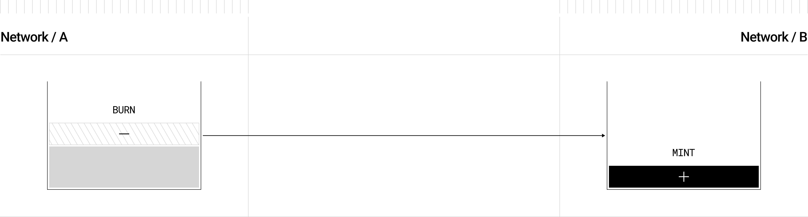

<p align="center">
  <a href="https://layerzero.network">
    
  </a>
</p>

<p align="center">
  <a href="https://layerzero.network" style="color: #a77dff">Homepage</a> | <a href="https://docs.layerzero.network/" style="color: #a77dff">Docs</a> | <a href="https://layerzero.network/developers" style="color: #a77dff">Developers</a>
</p>

<h1 align="center">LayerZero OFT Example</h1>

<p align="center">
  <a href="https://docs.layerzero.network/v2/home/protocol/contract-standards#oft" style="color: #a77dff">Quickstart</a> | <a href="https://docs.layerzero.network/contracts/oapp-configuration" style="color: #a77dff">Configuration</a> | <a href="https://docs.layerzero.network/contracts/options" style="color: #a77dff">Message Execution Options</a> | <a href="https://docs.layerzero.network/contracts/endpoint-addresses" style="color: #a77dff">Endpoint Addresses</a>
</p>

<p align="center">Template project for getting started with LayerZero's <code>OFT</code> Solana program development.</p>

## Omnichain Fungible Token (Beta)

The Omnichain Fungible Token (OFT) Standard allows fungible tokens to be transferred across multiple blockchains without asset wrapping or middlechains.

This standard works by burning tokens on the source chain whenever an omnichain transfer is initiated, sending a message via the protocol, and delivering a function call to the destination contract to mint the same number of tokens burned. This creates a unified supply across all networks LayerZero supports that the OFT is deployed on.



[Audit Reports](https://github.com/LayerZero-Labs/Audits)

## Prepare ProgramId

create programId keypair files if not existed

```
cd packages/solana/contracts

solana-keygen new -o target/deploy/endpoint-keypair.json
solana-keygen new -o target/deploy/oft-keypair.json

anchor keys sync
```

## Build & Test

```bash
yarn && yarn build && yarn test
```

## Deploy

```
cd packages/solana/contracts
```

1. with anchor

   ```bash
   anchor build -v
   solana program deploy --program-id target/deploy/oft-keypair.json target/verifiable/oft.so -u mainnet-beta
   ```

   or

2. with solana-verify
   ```bash
   solana-verify build
   solana program deploy --program-id target/deploy/oft-keypair.json target/deploy/oft.so -u mainnet-beta
   ```

please visit [Solana Verify CLI](https://github.com/Ellipsis-Labs/solana-verifiable-build) and [Deploy a Solana Program with the CLI](https://docs.solanalabs.com/cli/examples/deploy-a-program) for more detail.

#### Notice

If you encounter issues during compilation and testing, it might be due to the versions of Solana and Anchor. You can switch to Solana version `1.17.31` and Anchor version `0.29.0`, as these are the versions we have tested and verified to be working.
