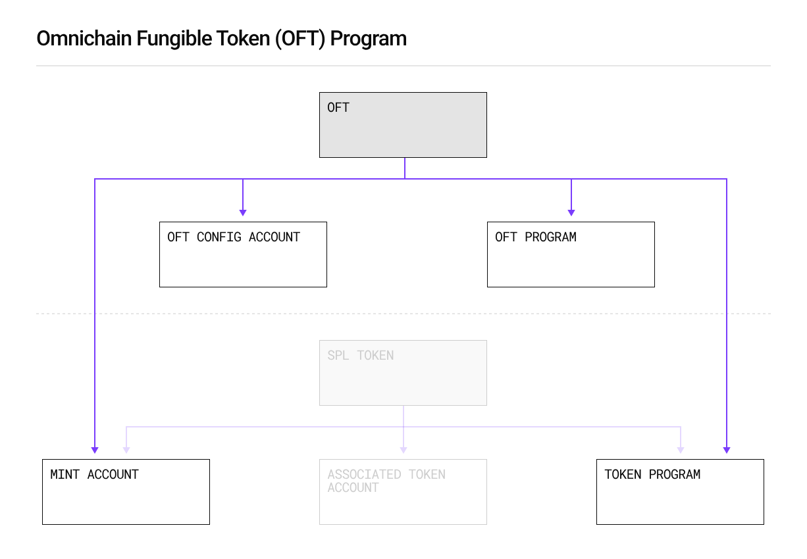

<p align="center">
  <a href="https://layerzero.network">
    
  </a>
</p>

<p align="center">
  <a href="https://layerzero.network" style="color: #a77dff">Homepage</a> | <a href="https://docs.layerzero.network/" style="color: #a77dff">Docs</a> | <a href="https://layerzero.network/developers" style="color: #a77dff">Developers</a>
</p>

<h1 align="center">Omnichain Fungible Token (OFT) Solana Example</h1>

<p align="center">
  <a href="https://docs.layerzero.network/v2/developers/evm/oft/quickstart" style="color: #a77dff">Quickstart</a> | <a href="https://docs.layerzero.network/contracts/oapp-configuration" style="color: #a77dff">Configuration</a> | <a href="https://docs.layerzero.network/contracts/options" style="color: #a77dff">Message Execution Options</a> | <a href="https://docs.layerzero.network/v2/developers/evm/technical-reference/deployed-contracts" style="color: #a77dff">Endpoint, MessageLib, & Executor Addresses</a> | <a
href="https://docs.layerzero.network/v2/developers/evm/technical-reference/dvn-addresses" style="color: #a77dff">DVN Addresses</a>
</p>

<p align="center">A boilerplate for streamlining the process of building, testing, deploying, and configuring <b>Omnichain Fungible Tokens (OFTs)</b> on Solana</p>

> [!WARNING]  
> The OFT Solana Example is currently an experimental build that is subject to changes.
>
> You can enable this build by running:
> <code>LZ_ENABLE_EXPERIMENTAL_SOLANA_OFT_EXAMPLE=1 npx create-lz-oapp@latest</code>

<p align="left>

- [So What is an Omnichain Fungible Token?](#omnichain-fungible-token)
- [OFT Solana Program (Beta)](#oft-solana-program-beta)
- [Installation](#installation)
- [Available Helpers in this Repo](#layerzero-hardhat-helper-tasks)

</p>

## Omnichain Fungible Token

The Omnichain Fungible Token (OFT) Standard allows fungible tokens to be transferred across multiple blockchains without asset wrapping or middlechains.

This standard works by burning tokens on the source chain whenever an omnichain transfer is initiated, sending a message via the protocol, and delivering a function call to the destination contract to mint the same number of tokens burned. This creates a unified supply across all networks LayerZero supports that the OFT is deployed on.

Read more about what you can do with OFTs by reading the [OFT Quickstart](https://docs.layerzero.network/v2/developers/evm/oft/quickstart) in the LayerZero Documentation.


## OFT Solana Program (Beta)

To be compatible with the Solana Account Model and composable with existing Solana DeFi applications, the Omnichain Fungible Token (OFT) Program extends the existing Solana Program Library (SPL) fungible token to interact with the LayerZero Endpoint, Message Library, DVN(s), and Executor programs.



[Audit Reports](https://github.com/LayerZero-Labs/Audits)

## Installation

#### Installing dependencies

We recommend using `pnpm` as a package manager (but you can of course use a package manager of your choice):

```bash
pnpm install
```

#### Compiling your program

```bash
pnpm compile
```

#### Running tests

```bash
pnpm test
```

### Preparing OFT Program ID

Create `programId` keypair files by running:

```bash
solana-keygen new -o target/deploy/endpoint-keypair.json
solana-keygen new -o target/deploy/oft-keypair.json

anchor keys sync
```

:warning: You will want to use the `--force` flag to generate your own keypair if these keys already exist.

### Deploying OFT Program

#### Using `anchor`

```bash
anchor build -v
solana program deploy --program-id target/deploy/oft-keypair.json target/verifiable/oft.so -u mainnet-beta
```

#### Using `solana-verify`

```bash
solana-verify build
solana program deploy --program-id target/deploy/oft-keypair.json target/deploy/oft.so -u mainnet-beta
```

please visit [Solana Verify CLI](https://github.com/Ellipsis-Labs/solana-verifiable-build) and [Deploy a Solana Program with the CLI](https://docs.solanalabs.com/cli/examples/deploy-a-program) for more detail.

#### Notice

If you encounter issues during compilation and testing, it might be due to the versions of Solana and Anchor. You can switch to Solana version `1.17.31` and Anchor version `0.29.0`, as these are the versions we have tested and verified to be working.

## LayerZero Hardhat Helper Tasks

LayerZero Devtools provides several helper hardhat tasks to easily deploy, verify, configure, connect, and send OFTs cross-chain.

<details>
<summary> <a href="https://docs.layerzero.network/v2/developers/evm/create-lz-oapp/deploying"><code>npx hardhat lz:deploy</code></a> </summary>

 <br>

Deploys your contract to any of the available networks in your [`hardhat.config.ts`](./hardhat.config.ts) when given a deploy tag (by default contract name) and returns a list of available networks to select for the deployment. For specifics around all deployment options, please refer to the [Deploying Contracts](https://docs.layerzero.network/v2/developers/evm/create-lz-oapp/deploying) section of the documentation. LayerZero's `lz:deploy` utilizes `hardhat-deploy`.

```yml
'arbitrum-sepolia': {
    eid: EndpointId.ARBSEP_V2_TESTNET,
    url: process.env.RPC_URL_ARBSEP_TESTNET,
    accounts,
},
'base-sepolia': {
    eid: EndpointId.BASESEP_V2_TESTNET,
    url: process.env.RPC_URL_BASE_TESTNET,
    accounts,
},
```

To add an existing deployment, refer to the `hardhat-deploy` instructions [here](https://github.com/wighawag/hardhat-deploy/blob/master/README.md#migrating-existing-deployment-to-hardhat-deploy).

</details>

<details>
<summary> <a href="https://docs.layerzero.network/v2/developers/evm/create-lz-oapp/start"><code>npx hardhat lz:oapp:config:init --oapp-config YOUR_OAPP_CONFIG --contract-name CONTRACT_NAME</code></a> </summary>

 <br>

Initializes a `layerzero.config.ts` file for all available pathways between your hardhat networks with the current LayerZero default placeholder settings. This task can be incredibly useful for correctly formatting your config file.

You can run this task by providing the `contract-name` you want to set for the config and `file-name` you want to generate:

```bash
npx hardhat lz:oapp:config:init --contract-name CONTRACT_NAME --oapp-config FILE_NAME
```

This will create a `layerzero.config.ts` in your working directory populated with your contract name and connections for every pathway possible between your hardhat networks:

```yml
import { EndpointId } from '@layerzerolabs/lz-definitions'

const arbsepContract = {
    eid: EndpointId.ARBSEP_V2_TESTNET,
    contractName: 'MyOFT',
}
const sepoliaContract = {
    eid: EndpointId.SEPOLIA_V2_TESTNET,
    contractName: 'MyOFT',
}

export default {
    contracts: [{ contract: arbsepContract }, { contract: sepoliaContract }],
    connections: [
        {
            from: arbsepContract,
            to: sepoliaContract,
            config: {
                sendLibrary: '0x4f7cd4DA19ABB31b0eC98b9066B9e857B1bf9C0E',
                receiveLibraryConfig: { receiveLibrary: '0x75Db67CDab2824970131D5aa9CECfC9F69c69636', gracePeriod: 0 },
                sendConfig: {
                    executorConfig: { maxMessageSize: 10000, executor: '0x5Df3a1cEbBD9c8BA7F8dF51Fd632A9aef8308897' },
                    ulnConfig: {
                        confirmations: 1,
                        requiredDVNs: ['0x53f488E93b4f1b60E8E83aa374dBe1780A1EE8a8'],
                        optionalDVNs: [],
                        optionalDVNThreshold: 0,
                    },
                },
                // receiveConfig: {
                //     ulnConfig: {
                //         confirmations: 2,
                //         requiredDVNs: ['0x53f488E93b4f1b60E8E83aa374dBe1780A1EE8a8'],
                //         optionalDVNs: [],
                //         optionalDVNThreshold: 0,
                //     },
                // },
            },
        },
        {
            from: sepoliaContract,
            to: arbsepContract,
            config: {
                sendLibrary: '0xcc1ae8Cf5D3904Cef3360A9532B477529b177cCE',
                receiveLibraryConfig: { receiveLibrary: '0xdAf00F5eE2158dD58E0d3857851c432E34A3A851', gracePeriod: 0 },
                // sendConfig: {
                //     executorConfig: { maxMessageSize: 10000, executor: '0x718B92b5CB0a5552039B593faF724D182A881eDA' },
                //     ulnConfig: {
                //         confirmations: 2,
                //         requiredDVNs: ['0x8eebf8b423B73bFCa51a1Db4B7354AA0bFCA9193'],
                //         optionalDVNs: [],
                //         optionalDVNThreshold: 0,
                //     },
                // },
                receiveConfig: {
                    ulnConfig: {
                        confirmations: 1,
                        requiredDVNs: ['0x8eebf8b423B73bFCa51a1Db4B7354AA0bFCA9193'],
                        optionalDVNs: [],
                        optionalDVNThreshold: 0,
                    },
                },
            },
        },
    ],
}
```

</details>

<details>
<summary> <a href="https://docs.layerzero.network/v2/developers/evm/create-lz-oapp/wiring"><code>npx hardhat lz:oapp:config:wire --oapp-config YOUR_OAPP_CONFIG</code></a> </summary>

 <br>

Calls the configuration functions between your deployed OApp contracts on every chain based on the provided `layerzero.config.ts`.

Running `lz:oapp:wire` will make the following function calls per pathway connection for a fully defined config file using your specified settings and your environment variables (Private Keys and RPCs):

- <a href="https://github.com/LayerZero-Labs/LayerZero-v2/blob/main/packages/layerzero-v2/evm/oapp/contracts/oapp/OAppCore.sol#L33-L46"><code>function setPeer(uint32 \_eid, bytes32 \_peer) public virtual onlyOwner {}</code></a>

- <a href="https://github.com/LayerZero-Labs/LayerZero-v2/blob/main/packages/layerzero-v2/evm/protocol/contracts/MessageLibManager.sol#L304-L311"><code>function setConfig(address \_oapp, address \_lib, SetConfigParam[] calldata \_params) external onlyRegistered(\_lib) {}</code></a>

- <a href="https://github.com/LayerZero-Labs/LayerZero-v2/blob/main/packages/layerzero-v2/evm/oapp/contracts/oapp/libs/OAppOptionsType3.sol#L18-L36"><code>function setEnforcedOptions(EnforcedOptionParam[] calldata \_enforcedOptions) public virtual onlyOwner {}</code></a>

- <a href="https://github.com/LayerZero-Labs/LayerZero-v2/blob/main/packages/layerzero-v2/evm/protocol/contracts/MessageLibManager.sol#L223-L238"><code>function setSendLibrary(address \_oapp, uint32 \_eid, address \_newLib) external onlyRegisteredOrDefault(\_newLib) isSendLib(\_newLib) onlySupportedEid(\_newLib, \_eid) {}</code></a>

- <a href="https://github.com/LayerZero-Labs/LayerZero-v2/blob/main/packages/layerzero-v2/evm/protocol/contracts/MessageLibManager.sol#L223-L273"><code>function setReceiveLibrary(address \_oapp, uint32 \_eid, address \_newLib, uint256 \_gracePeriod) external onlyRegisteredOrDefault(\_newLib) isReceiveLib(\_newLib) onlySupportedEid(\_newLib, \_eid) {}</code></a>

To use this task, run:

```bash
npx hardhat lz:oapp:wire --oapp-config YOUR_LAYERZERO_CONFIG_FILE
```

Whenever you make changes to the configuration, run `lz:oapp:wire` again. The task will check your current configuration, and only apply NEW changes.

To use a Gnosis Safe multisig as the signer for these transactions, add the following to each network in your `hardhat.config.ts` and add the `--safe` flag to `lz:oapp:wire --safe`:

```yml
// hardhat.config.ts

networks: {
  // Include configurations for other networks as needed
  fuji: {
    /* ... */
    // Network-specific settings
    safeConfig: {
      safeUrl: 'http://something', // URL of the Safe API, not the Safe itself
      safeAddress: 'address'
    }
  }
}
```

</details>
<details>
<summary> <a href="https://docs.layerzero.network/v2/developers/evm/create-lz-oapp/wiring#checking-pathway-config"><code>npx hardhat lz:oapp:config:get --oapp-config YOUR_OAPP_CONFIG</code></a> </summary>

 <br>

Returns your current OApp's configuration for each chain and pathway in 3 columns:

- **Custom Configuration**: the changes that your `layerzero.config.ts` currently has set

- **Default Configuration**: the default placeholder configuration that LayerZero provides

- **Active Configuration**: the active configuration that applies to the message pathway (Defaults + Custom Values)

If you do NOT explicitly set each configuration parameter, your OApp will fallback to the placeholder parameters in the default config.

```bash
┌────────────────────┬───────────────────────────────────────────────────────────────────────────────┬───────────────────────────────────────────────────────────────────────────────┬───────────────────────────────────────────────────────────────────────────────┐
│                    │ Custom OApp Config                                                            │ Default OApp Config                                                           │ Active OApp Config                                                            │
├────────────────────┼───────────────────────────────────────────────────────────────────────────────┼───────────────────────────────────────────────────────────────────────────────┼───────────────────────────────────────────────────────────────────────────────┤
│ localNetworkName   │ arbsep                                                                        │ arbsep                                                                        │ arbsep                                                                        │
├────────────────────┼───────────────────────────────────────────────────────────────────────────────┼───────────────────────────────────────────────────────────────────────────────┼───────────────────────────────────────────────────────────────────────────────┤
│ remoteNetworkName  │ sepolia                                                                       │ sepolia                                                                       │ sepolia                                                                       │
├────────────────────┼───────────────────────────────────────────────────────────────────────────────┼───────────────────────────────────────────────────────────────────────────────┼───────────────────────────────────────────────────────────────────────────────┤
│ sendLibrary        │ 0x4f7cd4DA19ABB31b0eC98b9066B9e857B1bf9C0E                                    │ 0x4f7cd4DA19ABB31b0eC98b9066B9e857B1bf9C0E                                    │ 0x4f7cd4DA19ABB31b0eC98b9066B9e857B1bf9C0E                                    │
├────────────────────┼───────────────────────────────────────────────────────────────────────────────┼───────────────────────────────────────────────────────────────────────────────┼───────────────────────────────────────────────────────────────────────────────┤
│ receiveLibrary     │ 0x75Db67CDab2824970131D5aa9CECfC9F69c69636                                    │ 0x75Db67CDab2824970131D5aa9CECfC9F69c69636                                    │ 0x75Db67CDab2824970131D5aa9CECfC9F69c69636                                    │
├────────────────────┼───────────────────────────────────────────────────────────────────────────────┼───────────────────────────────────────────────────────────────────────────────┼───────────────────────────────────────────────────────────────────────────────┤
│ sendUlnConfig      │ ┌──────────────────────┬────────────────────────────────────────────────────┐ │ ┌──────────────────────┬────────────────────────────────────────────────────┐ │ ┌──────────────────────┬────────────────────────────────────────────────────┐ │
│                    │ │ confirmations        │ 1                                                  │ │ │ confirmations        │ 1                                                  │ │ │ confirmations        │ 1                                                  │ │
│                    │ ├──────────────────────┼────────────────────────────────────────────────────┤ │ ├──────────────────────┼────────────────────────────────────────────────────┤ │ ├──────────────────────┼────────────────────────────────────────────────────┤ │
│                    │ │ requiredDVNs         │ ┌───┬────────────────────────────────────────────┐ │ │ │ requiredDVNs         │ ┌───┬────────────────────────────────────────────┐ │ │ │ requiredDVNs         │ ┌───┬────────────────────────────────────────────┐ │ │
│                    │ │                      │ │ 0 │ 0x53f488E93b4f1b60E8E83aa374dBe1780A1EE8a8 │ │ │ │                      │ │ 0 │ 0x53f488E93b4f1b60E8E83aa374dBe1780A1EE8a8 │ │ │ │                      │ │ 0 │ 0x53f488E93b4f1b60E8E83aa374dBe1780A1EE8a8 │ │ │
│                    │ │                      │ └───┴────────────────────────────────────────────┘ │ │ │                      │ └───┴────────────────────────────────────────────┘ │ │ │                      │ └───┴────────────────────────────────────────────┘ │ │
│                    │ │                      │                                                    │ │ │                      │                                                    │ │ │                      │                                                    │ │
│                    │ ├──────────────────────┼────────────────────────────────────────────────────┤ │ ├──────────────────────┼────────────────────────────────────────────────────┤ │ ├──────────────────────┼────────────────────────────────────────────────────┤ │
│                    │ │ optionalDVNs         │                                                    │ │ │ optionalDVNs         │                                                    │ │ │ optionalDVNs         │                                                    │ │
│                    │ ├──────────────────────┼────────────────────────────────────────────────────┤ │ ├──────────────────────┼────────────────────────────────────────────────────┤ │ ├──────────────────────┼────────────────────────────────────────────────────┤ │
│                    │ │ optionalDVNThreshold │ 0                                                  │ │ │ optionalDVNThreshold │ 0                                                  │ │ │ optionalDVNThreshold │ 0                                                  │ │
│                    │ └──────────────────────┴────────────────────────────────────────────────────┘ │ └──────────────────────┴────────────────────────────────────────────────────┘ │ └──────────────────────┴────────────────────────────────────────────────────┘ │
│                    │                                                                               │                                                                               │                                                                               │
├────────────────────┼───────────────────────────────────────────────────────────────────────────────┼───────────────────────────────────────────────────────────────────────────────┼───────────────────────────────────────────────────────────────────────────────┤
│ sendExecutorConfig │ ┌────────────────┬────────────────────────────────────────────┐               │ ┌────────────────┬────────────────────────────────────────────┐               │ ┌────────────────┬────────────────────────────────────────────┐               │
│                    │ │ executor       │ 0x5Df3a1cEbBD9c8BA7F8dF51Fd632A9aef8308897 │               │ │ executor       │ 0x5Df3a1cEbBD9c8BA7F8dF51Fd632A9aef8308897 │               │ │ executor       │ 0x5Df3a1cEbBD9c8BA7F8dF51Fd632A9aef8308897 │               │
│                    │ ├────────────────┼────────────────────────────────────────────┤               │ ├────────────────┼────────────────────────────────────────────┤               │ ├────────────────┼────────────────────────────────────────────┤               │
│                    │ │ maxMessageSize │ 10000                                      │               │ │ maxMessageSize │ 10000                                      │               │ │ maxMessageSize │ 10000                                      │               │
│                    │ └────────────────┴────────────────────────────────────────────┘               │ └────────────────┴────────────────────────────────────────────┘               │ └────────────────┴────────────────────────────────────────────┘               │
│                    │                                                                               │                                                                               │                                                                               │
├────────────────────┼───────────────────────────────────────────────────────────────────────────────┼───────────────────────────────────────────────────────────────────────────────┼───────────────────────────────────────────────────────────────────────────────┤
│ receiveUlnConfig   │ ┌──────────────────────┬────────────────────────────────────────────────────┐ │ ┌──────────────────────┬────────────────────────────────────────────────────┐ │ ┌──────────────────────┬────────────────────────────────────────────────────┐ │
│                    │ │ confirmations        │ 2                                                  │ │ │ confirmations        │ 2                                                  │ │ │ confirmations        │ 2                                                  │ │
│                    │ ├──────────────────────┼────────────────────────────────────────────────────┤ │ ├──────────────────────┼────────────────────────────────────────────────────┤ │ ├──────────────────────┼────────────────────────────────────────────────────┤ │
│                    │ │ requiredDVNs         │ ┌───┬────────────────────────────────────────────┐ │ │ │ requiredDVNs         │ ┌───┬────────────────────────────────────────────┐ │ │ │ requiredDVNs         │ ┌───┬────────────────────────────────────────────┐ │ │
│                    │ │                      │ │ 0 │ 0x53f488E93b4f1b60E8E83aa374dBe1780A1EE8a8 │ │ │ │                      │ │ 0 │ 0x53f488E93b4f1b60E8E83aa374dBe1780A1EE8a8 │ │ │ │                      │ │ 0 │ 0x53f488E93b4f1b60E8E83aa374dBe1780A1EE8a8 │ │ │
│                    │ │                      │ └───┴────────────────────────────────────────────┘ │ │ │                      │ └───┴────────────────────────────────────────────┘ │ │ │                      │ └───┴────────────────────────────────────────────┘ │ │
│                    │ │                      │                                                    │ │ │                      │                                                    │ │ │                      │                                                    │ │
│                    │ ├──────────────────────┼────────────────────────────────────────────────────┤ │ ├──────────────────────┼────────────────────────────────────────────────────┤ │ ├──────────────────────┼────────────────────────────────────────────────────┤ │
│                    │ │ optionalDVNs         │                                                    │ │ │ optionalDVNs         │                                                    │ │ │ optionalDVNs         │                                                    │ │
│                    │ ├──────────────────────┼────────────────────────────────────────────────────┤ │ ├──────────────────────┼────────────────────────────────────────────────────┤ │ ├──────────────────────┼────────────────────────────────────────────────────┤ │
│                    │ │ optionalDVNThreshold │ 0                                                  │ │ │ optionalDVNThreshold │ 0                                                  │ │ │ optionalDVNThreshold │ 0                                                  │ │
│                    │ └──────────────────────┴────────────────────────────────────────────────────┘ │ └──────────────────────┴────────────────────────────────────────────────────┘ │ └──────────────────────┴────────────────────────────────────────────────────┘ │
│                    │                                                                               │                                                                               │                                                                               │
└────────────────────┴───────────────────────────────────────────────────────────────────────────────┴───────────────────────────────────────────────────────────────────────────────┴───────────────────────────────────────────────────────────────────────────────┘
```

</details>
<details>
<summary> <a href="https://docs.layerzero.network/v2/developers/evm/create-lz-oapp/wiring#checking-pathway-executor"><code>npx hardhat lz:oapp:config:get:executor --oapp-config YOUR_OAPP_CONFIG</code></a> </summary>

 <br>

Returns the LayerZero Executor config for each network in your `hardhat.config.ts`. You can use this method to see the max destination gas in wei (`nativeCap`) you can request in your [`execution options`](https://docs.layerzero.network/v2/developers/evm/gas-settings/options).

```bash
┌───────────────────┬────────────────────────────────────────────┐
│ localNetworkName  │ mantle                                     │
├───────────────────┼────────────────────────────────────────────┤
│ remoteNetworkName │ polygon                                    │
├───────────────────┼────────────────────────────────────────────┤
│ executorDstConfig │ ┌────────────────┬───────────────────────┐ │
│                   │ │ baseGas        │ 85000                 │ │
│                   │ ├────────────────┼───────────────────────┤ │
│                   │ │ multiplierBps  │ 12000                 │ │
│                   │ ├────────────────┼───────────────────────┤ │
│                   │ │ floorMarginUSD │ 5000000000000000000   │ │
│                   │ ├────────────────┼───────────────────────┤ │
│                   │ │ nativeCap      │ 681000000000000000000 │ │
│                   │ └────────────────┴───────────────────────┘ │
│                   │                                            │
└───────────────────┴────────────────────────────────────────────┘
```

</details>

## LayerZero Solana Helper Tasks

This repo also comes with several Solana helpers in the form of Hardhat tasks to easily deploy, verify, configure, connect, and send OFTs on Solana.

These helpers use the `@metaplex-foundation/umi` TypeScript framework to interact with the Solana blockchain. For more information, refer to the [Umi documentation](https://developers.metaplex.com/umi).

<details>
<summary> <a href="https://docs.layerzero.network/v2/developers/solana/overview"><code>npx hardhat lz:oft:solana:create --program-id YOUR_OFT_PROGRAM_ID --eid YOUR_SOLANA_ENDPOINT_ID </code></a> </summary>

<br>

In addition to deploying your **OFT Program**, you will need to mint a new **SPL Token** and **OFT Config Account** to create your deployment. The `lz:oft:solana:create` task will create a new SPL Token Mint, and optionally mint an amount of tokens if given an amount.

```typescript
task('lz:oft:solana:create', 'Mints new SPL Token and creates new OFT Config account')
    .addParam('programId', 'The OFT Program id')
    .addParam('eid', 'Solana mainnet or testnet', undefined, types.eid)
    .addOptionalParam('amount', 'The initial supply to mint on solana', undefined, types.int)
    .setAction(async (taskArgs: Args) => {
      // ... task continues
    }
```

A successful mint will display the following output in your terminal:

```bash
✅ Token Mint Complete! View the transaction here: https://explorer.solana.com/tx/5EeWgwuH52T1YMSs1vNJZdpGRd1o8K8HYn3T45vv17Z9rXwgYq2LWfAweJYCTXDxpjJTzmJXC3P3oRKLinhsBtZn
Your token account is: 2w9iFgRJzdSmuoNH4WiLiD1jtEr7t2YtgiGmWNwNgrgo
OFT Config: PublicKey [PublicKey(AuRJrMHgGwVVeby68cA7nu4twpwYedvJJfVJqCjt4J3y)] {
  _bn: <BN: 9326de8a307c402b6233474c34123061491c1830a6a773c1cf7d0b66497f6ab8>
}
✅ You created an OFT, view the transaction here: https://explorer.solana.com/tx/5nikt8nzmfQTtCWCA93wpBDSiaGJJpzKzetGgq2RPYGyF1Hekup88CXKTzBCEhPsSpUFW7kuT8VD5G3sgRNjrY4J
Accounts have been saved to ./deployments/solana-mainnet/OFT.json
```

</details>

<details>
<summary> <a href="https://docs.layerzero.network/v2/developers/solana/overview"><code>npx hardhat lz:oapp:init:solana --oapp-config YOUR_OAPP_CONFIG --solana-secret-key YOUR_SOLANA_SECRET_KEY</code></a> </summary>

 <br>

After creating your Solana Config Account, you will need to initialize each account for every pathways you will be connecting. The `lz:oapp:init:solana` task will make these calls and initialize per the pathways defined in your `layerzero.config.ts`.

```typescript
// ./layerzero.config.ts
const arbitrumContract: OmniPointHardhat = {
  eid: EndpointId.ARBITRUM_V2_MAINNET,
  contractName: "MyOFT",
};

const solanaContract: OmniPointHardhat = {
  eid: EndpointId.SOLANA_V2_MAINNET,
  address: "YOUR_OFT_CONFIG_ACCOUNT",
};

// ... rest of LayerZero config
```

</details>

<details>
<summary> <a href="https://docs.layerzero.network/v2/developers/solana/overview"><code>npx hardhat lz:oapp:wire --oapp-config YOUR_OAPP_CONFIG --solana-program-id YOUR_OFT_PROGRAM_ID --solana-secret-key YOUR_SOLANA_SECRET_KEY</code></a> </summary>

 <br>

After initializing your accounts, run the standard `lz:oapp:wire` with the new flags (`--solana-program-id` & `--solana-secret-key`).

```bash
npx hardhat lz:oapp:wire --oapp-config layerzero.config.ts --solana-program-id YOUR_OFT_PROGRAM_ID --solana-secret-key YOUR_SOLANA_SECRET_KEY


              **********
            **************
          ******************
         ********************
         *********  *********
         *********  *********          ****                                                 ***********
         *********  *********          ****                                                 ***********
            ******  *********          ****        *************    ****  ******   *******       ****    ******    *** **   ******
          ********  *********          ****      *********** ****  **** ********** *******      ****   *********** ****** **********
         *********  ********           ****     ****    ****  ******** ***   ***** ****        ****   ****   ***** ****  ****    ****
         *********  ******             ****     ****    ****   ******* ********    ****      *****    *********    ***   ****    ****
         *********  *********          ********* ***********   ******   ********** ****     ********************** ***    **********  ****
         *********  *********          *********  **********    ****     ********  ****     ***********  ********  ***      *******   ****
         *********  *********                                 *****
         ********************                                 ****
          ******************
           ****************
              **********


info:    [OApp] Checking OApp configuration
info:    [OApp] Checking OApp delegates configuration
info:    [OApp] ✓ Checked OApp delegates
info:    [OApp] Checking OApp peers configuration
info:    [OApp] ✓ Checked OApp peers configuration
info:    [OApp] Checking send libraries configuration
info:    [OApp] ✓ Checked send libraries configuration
info:    [OApp] Checking receive libraries configuration
info:    [OApp] ✓ Checked receive libraries configuration
info:    [OApp] Checking receive library timeout configuration
info:    [OApp] ✓ Checked receive library timeout configuration
info:    [OApp] Checking send configuration
info:    [OApp] ✓ Checked send configuration
info:    [OApp] Checking receive configuration
info:    [OApp] ✓ Checked receive configuration
info:    [OApp] Checking enforced options
info:    [OApp] ✓ Checked enforced options
info:    [OApp] Checking OApp callerBpsCap configuration
info:    [OApp] ✓ Checked OApp callerBpsCap configuration
info:    [OApp] ✓ Checked OApp configuration
info:    The OApp is wired, no action is necessary
```

</details>

## Developing Contracts

#### Installing dependencies

We recommend using `pnpm` as a package manager (but you can of course use a package manager of your choice):

```bash
pnpm install
```

#### Compiling your contracts

This project supports both `hardhat` and `forge` compilation. By default, the `compile` command will execute both:

```bash
pnpm compile
```

If you prefer one over the other, you can use the tooling-specific commands:

```bash
pnpm compile:forge
pnpm compile:hardhat
```

Or adjust the `package.json` to for example remove `forge` build:

```diff
- "compile": "$npm_execpath run compile:forge && $npm_execpath run compile:hardhat",
- "compile:forge": "forge build",
- "compile:hardhat": "hardhat compile",
+ "compile": "hardhat compile"
```

#### Running tests

Similarly to the contract compilation, we support both `hardhat` and `forge` tests. By default, the `test` command will execute both:

```bash
pnpm test
```

If you prefer one over the other, you can use the tooling-specific commands:

```bash
pnpm test:forge
pnpm test:hardhat
pnpm test:anchor
```

Or adjust the `package.json` to for example remove `hardhat` tests:

```diff
- "test": "$npm_execpath test:forge && $npm_execpath test:hardhat",
- "test:forge": "forge test",
- "test:hardhat": "$npm_execpath hardhat test"
+ "test": "forge test"
```

## Deploying Contracts

Set up deployer wallet/account:

- Rename `.env.example` -> `.env`
- Choose your preferred means of setting up your deployer wallet/account:

```
MNEMONIC="test test test test test test test test test test test junk"
or...
PRIVATE_KEY="0xabc...def"
```

- Fund this address with the corresponding chain's native tokens you want to deploy to.

To deploy your contracts to your desired blockchains, run the following command in your project's folder:

```bash
npx hardhat lz:deploy
```

More information about available CLI arguments can be found using the `--help` flag:

```bash
npx hardhat lz:deploy --help
```

By following these steps, you can focus more on creating innovative omnichain solutions and less on the complexities of cross-chain communication.

<br></br>

## Connecting Contracts

### Ethereum Configurations

Fill out your `layerzero.config.ts` with the contracts you want to connect. You can generate the default config file for your declared hardhat networks by running:

```bash
npx hardhat lz:oapp:config:init --contract-name [YOUR_CONTRACT_NAME] --oapp-config [CONFIG_NAME]
```

> [!NOTE]
> You may need to change the contract name if you're deploying multiple OApp contracts on different chains (e.g., OFT and OFT Adapter).

<br>

```typescript
const ethereumContract: OmniPointHardhat = {
  eid: EndpointId.ETHEREUM_V2_MAINNET,
  contractName: "MyOFTAdapter",
};

const arbitrumContract: OmniPointHardhat = {
  eid: EndpointId.ARBITRUM_V2_MAINNET,
  contractName: "MyOFT",
};
```

Then define the pathway you want to create from and to each contract:

```typescript
connections: [
  // ETH <--> ARB PATHWAY: START
  {
    from: ethereumContract,
    to: arbitrumContract,
  },
  {
    from: arbitrumContract,
    to: ethereumContract,
  },
  // ETH <--> ARB PATHWAY: END
];
```

Finally, define the config settings for each direction of the pathway:

```typescript
connections: [
  // ETH <--> ARB PATHWAY: START
  {
    from: ethereumContract,
    to: arbitrumContract,
    config: {
      sendLibrary: contractsConfig.ethereum.sendLib302,
      receiveLibraryConfig: {
        receiveLibrary: contractsConfig.ethereum.receiveLib302,
        gracePeriod: BigInt(0),
      },
      // Optional Receive Library Timeout for when the Old Receive Library Address will no longer be valid
      receiveLibraryTimeoutConfig: {
        lib: "0x0000000000000000000000000000000000000000",
        expiry: BigInt(0),
      },
      // Optional Send Configuration
      // @dev Controls how the `from` chain sends messages to the `to` chain.
      sendConfig: {
        executorConfig: {
          maxMessageSize: 10000,
          // The configured Executor address
          executor: contractsConfig.ethereum.executor,
        },
        ulnConfig: {
          // The number of block confirmations to wait on BSC before emitting the message from the source chain.
          confirmations: BigInt(15),
          // The address of the DVNs you will pay to verify a sent message on the source chain ).
          // The destination tx will wait until ALL `requiredDVNs` verify the message.
          requiredDVNs: [
            contractsConfig.ethereum.horizenDVN, // Horizen
            contractsConfig.ethereum.polyhedraDVN, // Polyhedra
            contractsConfig.ethereum.animocaBlockdaemonDVN, // Animoca-Blockdaemon (only available on ETH <-> Arbitrum One)
            contractsConfig.ethereum.lzDVN, // LayerZero Labs
          ],
          // The address of the DVNs you will pay to verify a sent message on the source chain ).
          // The destination tx will wait until the configured threshold of `optionalDVNs` verify a message.
          optionalDVNs: [],
          // The number of `optionalDVNs` that need to successfully verify the message for it to be considered Verified.
          optionalDVNThreshold: 0,
        },
      },
      // Optional Receive Configuration
      // @dev Controls how the `from` chain receives messages from the `to` chain.
      receiveConfig: {
        ulnConfig: {
          // The number of block confirmations to expect from the `to` chain.
          confirmations: BigInt(20),
          // The address of the DVNs your `receiveConfig` expects to receive verifications from on the `from` chain ).
          // The `from` chain's OApp will wait until the configured threshold of `requiredDVNs` verify the message.
          requiredDVNs: [
            contractsConfig.ethereum.lzDVN, // LayerZero Labs DVN
            contractsConfig.ethereum.animocaBlockdaemonDVN, // Blockdaemon-Animoca
            contractsConfig.ethereum.horizenDVN, // Horizen Labs
            contractsConfig.ethereum.polyhedraDVN, // Polyhedra
          ],
          // The address of the `optionalDVNs` you expect to receive verifications from on the `from` chain ).
          // The destination tx will wait until the configured threshold of `optionalDVNs` verify the message.
          optionalDVNs: [],
          // The number of `optionalDVNs` that need to successfully verify the message for it to be considered Verified.
          optionalDVNThreshold: 0,
        },
      },
      // Optional Enforced Options Configuration
      // @dev Controls how much gas to use on the `to` chain, which the user pays for on the source `from` chain.
      enforcedOptions: [
        {
          msgType: 1,
          optionType: ExecutorOptionType.LZ_RECEIVE,
          gas: 65000,
          value: 0,
        },
        {
          msgType: 2,
          optionType: ExecutorOptionType.LZ_RECEIVE,
          gas: 65000,
          value: 0,
        },
        {
          msgType: 2,
          optionType: ExecutorOptionType.COMPOSE,
          index: 0,
          gas: 50000,
          value: 0,
        },
      ],
    },
  },
  {
    from: arbitrumContract,
    to: ethereumContract,
  },
  // ETH <--> ARB PATHWAY: END
];
```

To set these config settings, run:

```bash
npx hardhat lz:oapp:wire --oapp-config layerzero.config.ts
```

<p align="center">
  Join our community on <a href="https://discord-layerzero.netlify.app/discord" style="color: #a77dff">Discord</a> | Follow us on <a href="https://twitter.com/LayerZero_Labs" style="color: #a77dff">Twitter</a>
</p>
